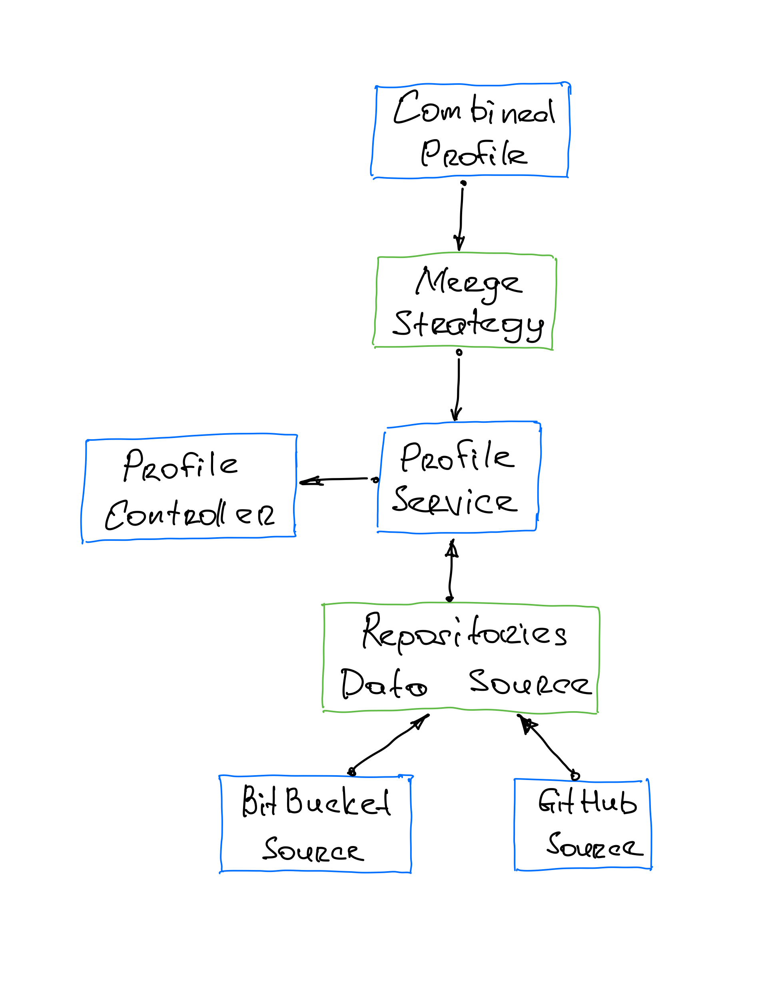

Aggregator
-----

### Stack

Used stack:

- Java JDK 11
- SpringBoot
- Spring MVC

### Schema

[//]: # (![Tag switcher]&#40;schema.png&#41;)

Explanation:

- `AggregatorApplication` Spring boot application entry point. Ignites Spring stack and runs application.
- `ProfileController` rest endpoint that serves routes at `GET <HOST>/proofiles/<ORG_NAME>`, where `<ORG_NAME>` is an
  organisation name to build profile for. Default host value is `http://localhos:8080`.
- `ProfileService` connection entity for `ProfileController`, `MergeStrategy` and `RepositoriesDataSource`. Collects
  repo info from all the registered sources and builds representation by applying concrete `MergeStrategy`.
- `RepositoriesDataSource` abstraction that allows to pull repos data from different sources and store them in unified
  way in `RepositoryData` objects. All the implementations of `RepositoriesDataSource` are automatically considered
  during data collection stage. Two implementations are available by default: `BitBucketSource` and `GitHubSource`.
- `MergeStrategy` provides abstraction that combines and represents collected `RepositoryData` in a specific
  way. `CombinedProfile` implementation builds composed statistics for the team using attached repo data sources.
- `Configuration`provides http client setup that used across `GitHubSource` and `BitBucketSource`
